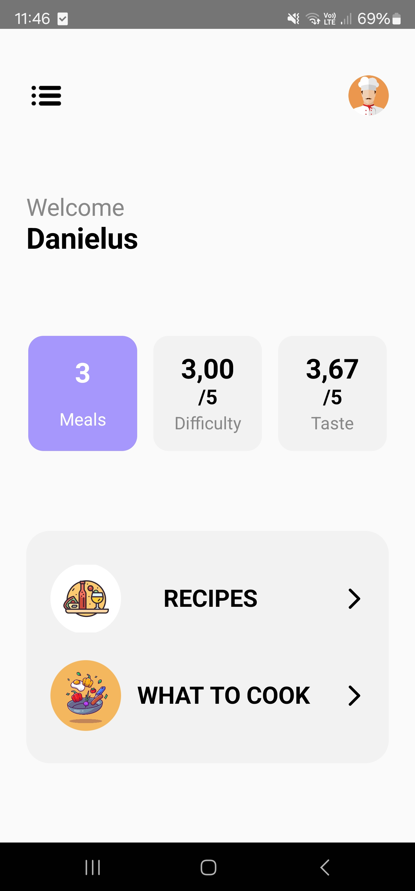
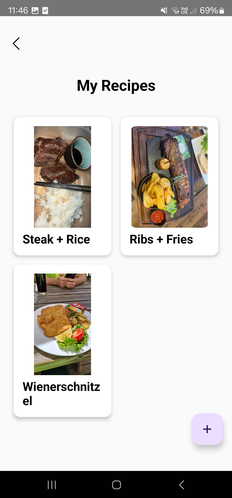

# MealSaver App

### Summary
App where you can save meals with all the important infos (taste, difficulty, instructions), so when you don't know what to cook you can look up all the things that you know how to cook

## Images

  
  

##  What can it do?
Whit this app you are able to save meals and look them up later. This app was made with the idea in mind, that many people, especiaolly students like myself, often don't know what to cook and fall into a repetetive meal cycle. To avoid that, one can look up all the meals saved in the app and choose one, or add a new one to the collection ;)
Also there is a section, where you can get a random dish displayed, for when you really don't know what to cook

### Planned Updates
- Add ingredient list for meals
- Add personalised profile picture
- Add dark/light mode and different languages
- Add different modes for meal list sort (difficulty high to low, taste etc.)
- Add more features to the randomize section (get random meal, that uses all the ingredients that you currently have etc.)
